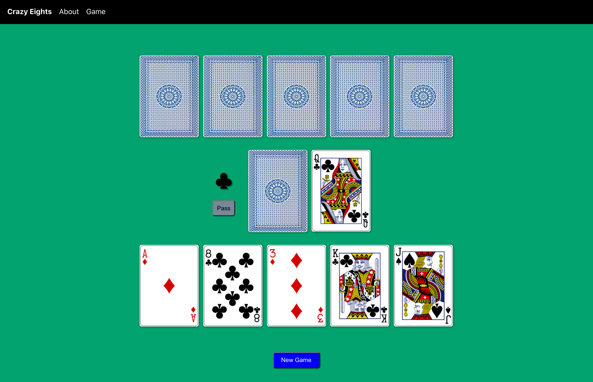

# Crazy Eights 

### Description  
A crazy eights card game played against the computer. Built with React for the Mintbean Hiring Hackathon for Jr Web Devs.

Live Site: [https://crazyeights.netlify.app](https://crazyeights.netlify.app)

### Getting Started 
- Clone or download the repo.  
- Install dependencies by running `yarn install`
- Run the app in development mode with `yarn start`
- View the app at http://localhost:3000 
- To build the app for production run `yarn build`

### How to play 
- Click Deal to start the game
- Click on a card from your hand that matches either the suit or the value of the top card in the discard pile
- If you don't have any cards that are playable you must click on the deck to draw a card
- After drawing a card you can play a card, draw another card, or pass
- Eights are wild and can be played at any time
- When you play an eight you will choose what suit must be played next
- To win be the first to discard all of your cards

### Tech Stack
- React.js
- JavaScript
- CSS
- HTML 

### Contact 
- Developer: Blakely Burns  
- LinkedIn: [https://www.linkedin.com/in/blakelyburns](https://www.linkedin.com/in/blakelyburns)
- GitHub: [https://github.com/blakes24](https://github.com/blakes24) 
